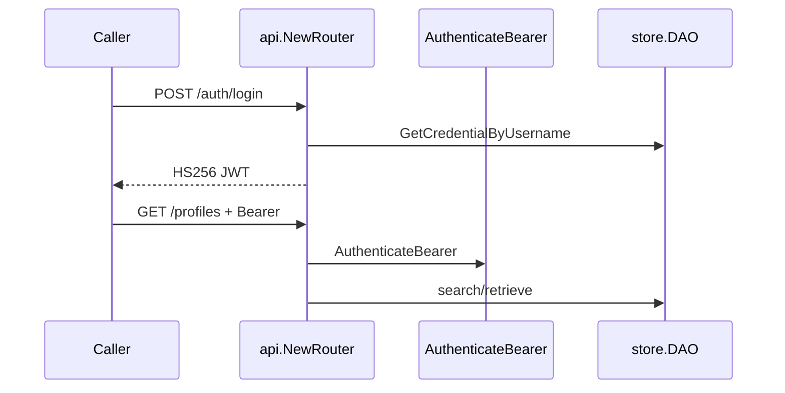

# Engineering handoff: Identity Go service

**Worktree:** `_worktrees/ENG-561` (`feat/ENG-561`)  
**Parade (captures):** [ENG-561-identity-go-service.md](ENG-561-identity-go-service.md)  
**Replay:** from worktree root, [`make demo`](../../Makefile) (needs `sqlite3` on PATH for U1). Live HTTP notebook: [ENG-561-validating-walk.md](ENG-561-validating-walk.md).

Lead 2026-10-06 withdrew REST enrich / composed IdP caller path (former AC-10, VC-2, TP-6, demo U6). Public REST is login, register, authenticated profile search/retrieve. IdP connector remains a library + httptest ([`internal/idp`](../../internal/idp), AC-3 / AC-9 / TP-5). [`cmd/fake-idp`](../../cmd/fake-idp/main.go) may remain as a connector helper; [`make demo`](../../Makefile) does not start it.

## What this is

A local Identity service for interview discussion. Callers log in against stored credentials, get an HS256 JWT, then search/retrieve profiles. It does not expose a vendor-directory lookup on the public API.

Not LoginID production: plaintext-or-as-stored passwords, JWT secret is a flag default, no passkeys/SDK.

## Layout

| Package | Role |
|---------|------|
| [`internal/store`](../../internal/store) | DAO port + SQLite/Postgres adapters (goose + sqlc) |
| [`internal/auth`](../../internal/auth) | Credential check, JWT issue/verify, `AuthenticateBearer` |
| [`internal/idp`](../../internal/idp) | HTTP client for vendor `/auth` + `/identity` (library; httptest) |
| [`internal/api`](../../internal/api) | OpenAPI-generated handlers + `nethttp-middleware` validator |
| [`cmd/server`](../../cmd/server/main.go) | Flags, `store.Open`, seed, listen |
| [`cmd/fake-idp`](../../cmd/fake-idp/main.go) | Optional connector test helper; not required for [`make demo`](../../Makefile) |

`store.Open` switches on `DBConfig.Driver`. Callers never import a dialect. `api.NewRouter` takes DAO + auth service only.

## Data model

- `user_profiles`: `id`, `name`, **one-string** `address`, `phone`, timestamps
- `user_credentials`: `id`, `user_id`, unique `username`, `method`, `password`, timestamps

IdP PII `address` is structured (`street_address`, `locality`, `region`, `postal_code`, `country`) on the connector types only.

Seed: Alice `11111111-…` / `alice` / `password123`; Bob `22222222-…` for search.

## HTTP surface

| Method | Path | Auth | Meaning |
|--------|------|------|---------|
| POST | `/auth/login` | none | credential → JWT |
| POST | `/auth/register` | none | create profile + credential |
| GET | `/profiles` | Bearer | search `name` / `phone` |
| GET | `/profiles/{id}` | Bearer | retrieve |

Live gate: OpenAPI `BearerAuth` → `AuthenticationFunc` → `auth.Service.AuthenticateBearer` ([`internal/api/handler.go`](../../internal/api/handler.go)).

## Request flow



## Limits

- JWT secret default `dev-jwt-secret-interview-mock-long-enough`. Passwords compared as stored.
- [`make demo`](../../Makefile) U1 shells out to `sqlite3`; host without it fails closed (`command not found`), not a silent green.
- Register exists; VC-1 bootstrap is seed + SQLite readback.

## Replay

```bash
cd _worktrees/ENG-561
make demo
go test ./...
```
