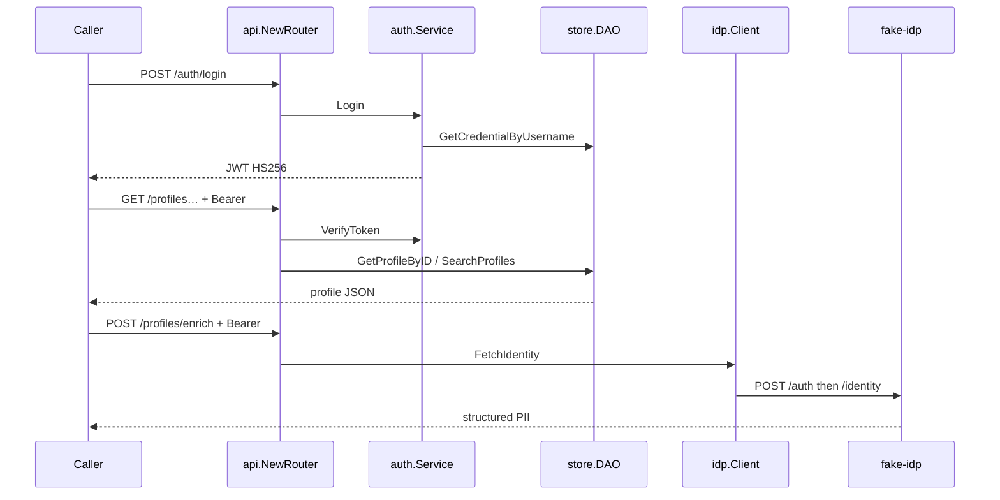

# Engineering handoff: Identity Go service

**SHA:** `ac67a2d18da13d4c791f3007af52ff51995a4728`  
**Worktree:** `_worktrees/ENG-561` (`feat/ENG-561`)  
**Parade (captures):** [ENG-561-identity-go-service.md](ENG-561-identity-go-service.md)  
**Replay:** from worktree root, `make demo`

This is Steward's reading of the landed code and a live `make demo` drive (not a copy of the Implementor Parade). Two Validating nits are in-flight after this SHA: shared Bearer parse + quiet 401s, and a real U1 SQLite readback in `scripts/demo.sh`.

## What this is

A local Identity service for interview discussion. Callers log in against stored credentials, get an HS256 JWT, then search/retrieve profiles. A separate connector talks to a fake ABC/XYC-shaped IdP (`POST /auth`, `POST /identity`) and returns PII on `POST /profiles/enrich` without writing that PII into the DAO.

It is not LoginID production: passwords may be stored as plaintext, JWT secret is a flag default, passkeys/FIDO2/SDK are out.

## Layout

| Package | Role |
|---------|------|
| `internal/store` | DAO port + SQLite/Postgres adapters (goose + sqlc) |
| `internal/auth` | Credential check, JWT issue/verify |
| `internal/idp` | HTTP client for vendor `/auth` + `/identity` |
| `internal/api` | OpenAPI-generated handlers + `nethttp-middleware` validator |
| `cmd/server` | Flags, `store.Open`, seed, listen |
| `cmd/fake-idp` | Simulator used by `make demo` |

Callers never pick a SQL dialect. `store.Open` switches on `DBConfig.Driver` (`sqlite` | `postgres`). Postgres `openPostgres` is a package-level func var assigned from `postgres.go` `init`.

## Data model

Two tables, same shape on both backends ([sqlite migration](../../internal/store/sqlite/migrations/00001_init.sql)):

- `user_profiles`: `id`, `name`, `address` (single string on the DAO/REST retrieve path), `phone`, timestamps
- `user_credentials`: `id`, `user_id`, `username` unique, `method`, `password`, timestamps

Observed: local profile `address` is one string. IdP PII `address` is structured (`street_address`, `locality`, `region`, `postal_code`, `country`). Enrich does not merge those shapes into the DAO.

Seeded demo users (`cmd/server` `-seed`): Alice `11111111-…` / `alice` / `password123`; Bob `22222222-…` for search.

## HTTP surface (`project/openapi.yaml`)

| Method | Path | Auth | Handler |
|--------|------|------|---------|
| POST | `/auth/login` | none | credential check → JWT |
| POST | `/auth/register` | none | create profile + credential |
| GET | `/profiles` | Bearer | search by `name` / `phone` query |
| GET | `/profiles/{id}` | Bearer | retrieve |
| POST | `/profiles/enrich` | Bearer | IdP `FetchIdentity`; PII in response only |

Protected routes are those OpenAPI marks with `BearerAuth`. `NewRouter` wraps the generated handler with `middleware.OapiRequestValidatorWithOptions`. `AuthenticationFunc` parses `Authorization: Bearer`, calls `auth.Service.VerifyToken`, stashes claims on the request context.

Login (observed from `make demo`):

```http
POST /auth/login
{"username":"alice","password":"password123"}

→ 200 {"token":"<jwt>","token_type":"Bearer","expires_in":86400}
```

Retrieve (observed):

```http
GET /profiles/11111111-1111-1111-1111-111111111111
Authorization: Bearer <jwt>

→ 200 {"id":"11111111-…","name":"Alice Smith","address":"123 Market St, San Francisco, CA 94105","phone":"+15551234567",…}
```

Search `?name=Smith` returns Alice and Bob. Missing or garbage Bearer on GET `/profiles/{id}` returns **401** with `error: unauthorized`. At this SHA the invalid-token body still wraps jwt library text (`token is malformed: …`).

Enrich (observed; fake IdP process):

```http
POST /profiles/enrich
Authorization: Bearer <jwt>
{"name":"Robert Taylor","phone":"+15552345678"}

→ 200
{"name":"Robert Taylor","phone":"+15552345678",
 "address":{"street_address":"789 Market Street, Suite 400","locality":"San Francisco","region":"CA","postal_code":"94103","country":"USA"}}
```

`EnrichProfile` calls `idpConn.FetchIdentity` only. No `CreateProfile` / update on that path.

## Request flow



## Limits (current SHA)

- JWT secret default: `dev-jwt-secret-interview-mock-long-enough` (`cmd/server/main.go`). Passwords compared as stored strings.
- `auth.Service.Middleware` is unused by `NewRouter`; live gate is OpenAPI middleware. `TestAuthMiddleware_Protection` still hits the dead path.
- `scripts/demo.sh` U1 prints a canned “Verified: … migrations applied” line; U3/U4 prove rows via HTTP, not a direct SQLite query.
- Register exists on the API even though VC-1 bootstrap is seed/fixture.

## Replay

```bash
cd _worktrees/ENG-561
make demo          # SQLite + fake IdP, U1–U6
go test ./...      # includes Postgres testcontainers
```

Instrument stamp: `/tmp/helm-ir-battery/ENG-561/ac67a2d18da13d4c791f3007af52ff51995a4728.json`
