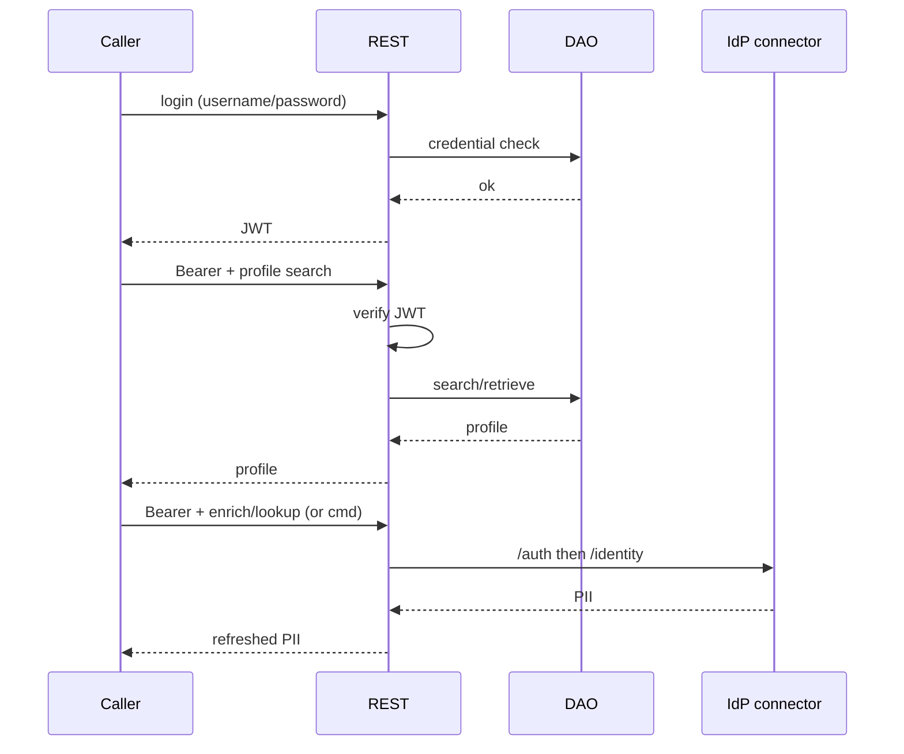

# Proof Parade: Identity Go service (interview discussion object)

**Brief**: [project/briefs/identity-go-service.md](../briefs/identity-go-service.md)
**Task**: ENG-561
**Date**: 2026-10-06
**Scaffold drafted by**: Steward
**Evidence captured by**: Implementor

<!-- Proof Parade: Lead-comprehension artifact. Evidence Index maps every AC and VC to What-landed and/or an Exhibit (not appendix-only). ACs: named tests. VCs: the surface driven live — screenshot, scripted interaction recording, request/response against a running server, terminal session, stored state read back. Reproduction appendix points at /tmp/helm-ir-battery/<ref>/<sha>.json + tests + how to reconstruct each VC. Steward scaffolds contracts→slots; Implementor fills. Lead Made audits understanding. -->

## Evidence Index

| Criterion | Planned evidence | Captured evidence | What it proves |
|---|---|---|---|
| AC-1 | What-landed: DAO contract path | _pending_ | DAO contract exists before code |
| AC-2 | What-landed: REST/OpenAPI + JWT decision cite | _pending_ | REST + JWT bearer locked |
| AC-3 | What-landed: IdP integrations contract path | _pending_ | IdP `/auth` + `/identity` contracted |
| AC-4 | What-landed: separation statements in contracts | _pending_ | DAO/HTTP/IdP seams named |
| AC-5 | What-landed: commit order Phase A before B | _pending_ | Sequencing held |
| AC-6 | TP-2, TP-3 / What-landed DAO packages | _pending_ | Dual-DB DAO landed |
| AC-7 | TP-4 / Exhibit Auth+profile | _pending_ | JWT issue + verify |
| AC-8 | TP-8 + Exhibit Auth+profile (search) | _pending_ | Profile search/retrieve |
| AC-9 | TP-5 | _pending_ | Connector wire fidelity |
| AC-10 | TP-6 / Exhibit Composed IdP path | _pending_ | Composed PII path (SK-2) |
| AC-11 | What-landed: go.mod modules | _pending_ | Locked deps present |
| AC-12 | This Index complete for seams | _pending_ | Parade covers boundaries |
| AC-13 | TP-7 battery / `go test ./...` | _pending_ | Suite green |
| AC-14 | Exhibits VC-1–VC-3 filled | _pending_ | Live VCs captured |
| TP-1 | Commit order / artifact paths | _pending_ | Phase A before B |
| TP-2 | Named DAO SQLite test | _pending_ | SQLite DAO |
| TP-3 | Named PG testcontainers test | _pending_ | Postgres DAO |
| TP-4 | Named JWT auth tests | _pending_ | Auth gate |
| TP-5 | Named connector mapping tests | _pending_ | IdP shapes |
| TP-6 | Named composed-path behavioral test (+ optional boundary) | _pending_ | SK-2 composition |
| TP-7 | `go test ./...` | _pending_ | Full suite |
| TP-8 | Named HTTP search/retrieve tests | _pending_ | Authenticated REST profile handlers |
| VC-1 | Exhibit: Auth+profile round-trip | _pending_ | Live seed→login→bearer→profile |
| VC-2 | Exhibit: Composed IdP path | _pending_ | Live connector composition |
| VC-3 | Exhibit: Auth gate refusal | _pending_ | Live reject without/invalid token |

Every AC and every VC gets an Index row whose Captured column points at **What landed** and/or an **Exhibit**. The Reproduction appendix is not a substitute for an Index row.

**AC captured evidence** is a named test. **VC captured evidence** is the thing itself, driven: a screenshot of the page, a recording of the scripted interaction, a request and its response against a running server, a terminal session, a row read back out of the store. A test name in a VC cell is not proof.

## What landed

_Steward scaffold — Implementor fills after Phase B/C._

- **DAO contract / AC-1, AC-6:** _pending_ — before → dual-DB persistence working
- **REST + JWT / AC-2, AC-7, AC-8:** _pending_ — bearer-protected profile search/retrieve
- **IdP connector / AC-3, AC-9:** _pending_ — `/auth` + `/identity` client
- **Composed path / AC-10:** _pending_ — REST and/or `cmd` invoking connector without DAO merge
- **Interaction designed:**



## Exhibits

### Exhibit: Auth+profile round-trip

**What the Lead should see/feel:** A running server accepts credential login, returns a JWT, and serves authenticated profile search/retrieve with `Authorization: Bearer`.
**Maps to:** AC-7, AC-8, VC-1
**Captured:** _pending_

```text
[Implementor: request/response transcript]
```

### Exhibit: Composed IdP path

**What the Lead should see/feel:** The composed callable path (authenticated REST enrich/lookup and/or thin `cmd`) talks to a fake IdP implementing `/auth` and `/identity` and returns/refreshes PII. Isolated connector httptest alone is not this exhibit.
**Maps to:** AC-10, VC-2
**Captured:** _pending_

```text
[Implementor: request/response or terminal session]
```

### Exhibit: Auth gate refusal

**What the Lead should see/feel:** A protected profile route rejects missing or invalid bearer without leaking profile PII.
**Maps to:** AC-7, VC-3
**Captured:** _pending_

```text
[Implementor: request/response transcript]
```

## Reproduction appendix

- **Battery report:** `/tmp/helm-ir-battery/ENG-561/<sha>.json` — _pending_
- **Named tests:** TP-2–TP-7 module paths — _pending_
- **VC drivers:** _pending_ — one exact task-worktree-root command per VC-1–VC-3; match `implementation_handoff.vc_drivers`
- **Commands (non-battery):** `go test ./...` per `project/helm-config.yaml`

## Known Gaps

- Interview mock: credential-at-rest and JWT signing defaults may be weak by design (see `project/decisions/interview-mock-security-latitude.md`); Parade does not prove production hardening.
- Real LoginID cloud / SDK / passkeys are out of scope; exhibits use local JWT + fake IdP only.
